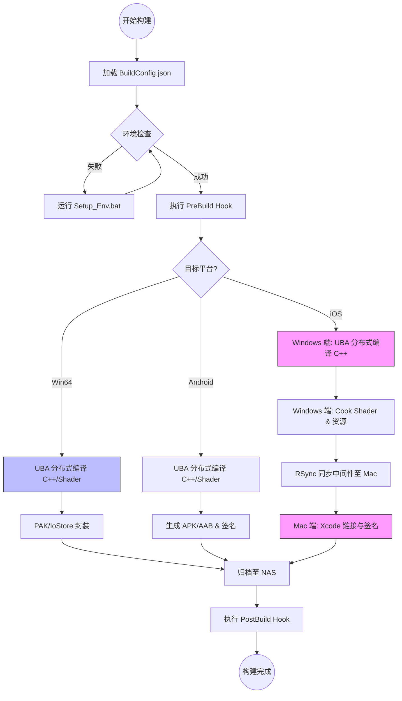
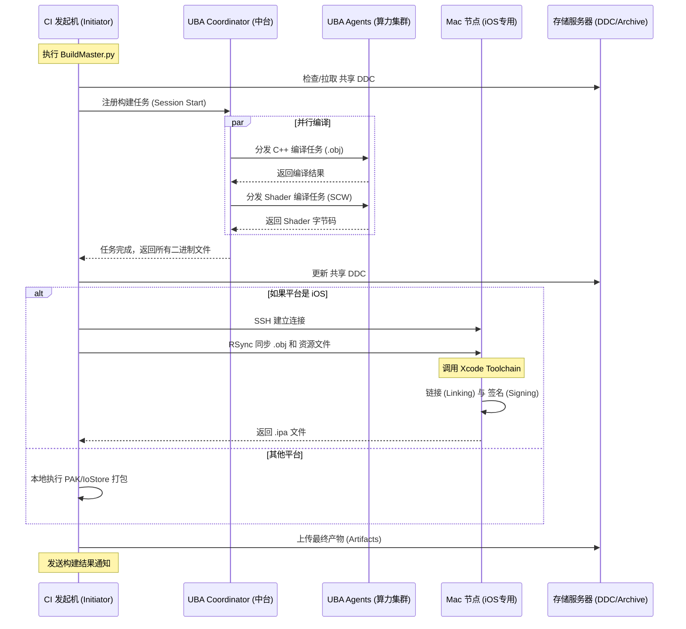

# UE5 分布式构建系统 - 业务线快速接入指南 (SDK模式)

本指南旨在帮助技术中台将分布式构建能力打包成 SDK，供各游戏项目组快速接入，实现“配置即用”。

## 1. 接入前提与责任边界 (New)

**核心原则：业务线只需关注“发起构建”，算力由中台提供。**

| **角色** | **归属方** | **职责** | **硬件要求** |
| --- | --- | --- | --- |
| **CI Runner (发起机)** | **业务项目组** | 运行 Jenkins/GitLab Agent，拉取代码，执行构建脚本。 | Windows PC/Server (1台)

推荐 16GB+ 内存，SSD |
| **UBA Farm (算力集群)** | **技术中台** | 提供 CPU 算力加速 C++ 和 Shader 编译。 | **业务组无需配置**

只需连接中台 IP |
| **Mac Builder (打包机)** | 项目组 或 中台 | 执行 iOS 签名。 | Mac (1台)

若中台不提供公共Mac池，则需项目组自备 |

## 2. 交付物标准结构 (The Package)

建议将构建工具链整理为一个独立的 Git 仓库或 Submodule，业务方只需将其拉取到项目根目录的 `Build/` 文件夹下。

**推荐目录结构：**

```
MyGame/ (业务项目根目录)
├── Build/ (构建工具包 - Git Submodule)
│   ├── Scripts/
│   │   ├── BuildMaster.py      # [核心] 通用构建逻辑 (不可变)
│   │   ├── Inject_Global_Config.py # [工具] 修改本地 UBT 配置
│   │ └── Requirements.txt    # Python 依赖
│   ├── Tools/
│   │   ├── Setup_Env.bat       # [工具] 一键环境初始化脚本
│   │   └── rsync.exe           # [工具] 预置依赖工具
│   └── Templates/
│   │   └── BuildConfig.template.json
├── Config/
│   └── BuildSystem/
│       └── BuildConfig.json    # [配置] 业务方只需修改此文件
├── MyGame.uproject
└── Source/

```

## 3. 核心配置文件 (`BuildConfig.json`)

**设计理念**：业务方不需要修改 Python 代码，所有差异化参数（项目名、Mac IP、密钥路径）全部抽离到 JSON 中。

在中台提供的 `Templates` 文件夹中放入此模版：

```
{
  "ProjectName": "MyGame",
  "EngineVersion": "5.3",
  "EngineRoot": "C:/UnrealEngine/UE_5.3",
  "SharedDDC": "\\\\NasServer\\DDC",
  "ArtifactsDir": "\\\\NasServer\\Builds",

  "Platforms": {
    "IOS": {
      "RemoteServer": "192.168.1.100",
      "RemoteUser": "buildbot",
      "SshKeyPath": "C:/Keys/id_rsa",
      "TeamId": "A1B2C3D4E5",
      "Provision": "Match_AppStore_MyGame.mobileprovision"
    },
    "Android": {
      "NDKVersion": "r25b",
      "KeyStorePath": "Secrets/release.keystore"
    }
  },

  "UBA": {
    "Enabled": true,
    "CoordinatorIP": "192.168.1.50"
  }
}

```

## 4. 重构后的通用构建脚本 (`BuildMaster.py`)

修改之前的 Python 脚本，使其从 JSON 读取配置，而不是硬编码。这样中台维护一份脚本即可支持 N 个项目。

```
import argparse
import json
import os
import subprocess
import sys

# 读取配置文件
def load_config(config_path):
    with open(config_path, 'r') as f:
        return json.load(f)

# 动态构建命令
def get_build_command(args, config):
    project_file = os.path.abspath(f"../../{config['ProjectName']}.uproject")
    uat_path = os.path.join(config['EngineRoot'], "Engine/Build/BatchFiles/RunUAT.bat")

    cmd = [
        uat_path, "BuildCookRun",
        f"-project={project_file}",
        f"-clientconfig={args.config}",
        # ... 通用参数 ...
        f"-archivedirectory={os.path.join(config['ArtifactsDir'], args.platform)}"
    ]

    # UBA 注入
    if config['UBA']['Enabled']:
        cmd.extend(["-distributed", "-uba"])
        # Python 脚本会自动读取 Inject_Global_Config.py 写入的全局配置
        # 或者在此处显式指定 Coordinator (取决于 UBT 版本)
        # cmd.append(f"-ubacoordinator={config['UBA']['CoordinatorIP']}")

    # iOS 特有逻辑
    if args.platform == "IOS":
        ios_conf = config['Platforms']['IOS']
        cmd.extend([
            "-platform=IOS",
            f"-remoteserver={ios_conf['RemoteServer']}",
            f"-remoteuser={ios_conf['RemoteUser']}",
            f"-sshkey={ios_conf['SshKeyPath']}"
        ])

    return cmd

def main():
    parser = argparse.ArgumentParser()
    parser.add_argument("--platform", required=True)
    parser.add_argument("--config", default="Development")
    parser.add_argument("--json_config", default="../Config/BuildSystem/BuildConfig.json")
    args = parser.parse_args()

    if not os.path.exists(args.json_config):
        print(f"Error: Config file not found at {args.json_config}")
        sys.exit(1)

    config_data = load_config(args.json_config)
    cmd = get_build_command(args, config_data)

    # 执行命令...
    print(f"Executing: {' '.join(cmd)}")
    # subprocess.call(cmd) ...

if __name__ == "__main__":
    main()

```

## 5. 一键环境初始化脚本 (`Setup_Env.bat`)

为了减少业务方的环境配置痛苦（例如忘记配 SSH Key，忘记装 Python 库），提供一个 Bootstrap 脚本。

此脚本仅需在 CI Runner (发起机) 上运行一次。

```
@echo off
SETLOCAL

echo [Infrastructure] Initializing Build Environment (Client Mode)...

:: 1. 检查 Python
python --version >nul 2>&1
IF %ERRORLEVEL% NEQ 0 (
    echo [Error] Python is not installed! Please install Python 3.x.
    exit /b 1
)

:: 2. 检查配置文件
if not exist "..\..\Config\BuildSystem\BuildConfig.json" (
    echo [Info] Creating default config from template...
    mkdir "..\..\Config\BuildSystem" 2>nul
    copy "..\Templates\BuildConfig.template.json" "..\..\Config\BuildSystem\BuildConfig.json"
    echo [Action] Please edit Config/BuildSystem/BuildConfig.json with your project details.
    pause
    exit /b 0
)

:: 3. 注入全局 UBT 配置 (关键步骤)
:: 这步操作会将中台的 Coordinator IP 写入业务机器的 AppData XML 中
echo [Info] Connecting local machine to UBA Farm...
python Scripts/Inject_Global_Config.py

echo [Success] Environment Ready. This machine is now a UBA Client.
ENDLOCAL

```

## 6. 附录：配置注入脚本逻辑 (`Inject_Global_Config.py`)

业务方通常不知道如何修改 XML。这个脚本通过读取 `BuildConfig.json` 中的 `CoordinatorIP`，自动修改 `BuildConfiguration.xml`。

```
# 伪代码逻辑
# 1. 读取 BuildConfig.json 获取 CoordinatorIP (如 192.168.1.50)
# 2. 定位 %APPDATA%/Unreal Engine/UnrealBuildTool/BuildConfiguration.xml
# 3. 使用 xml.etree.ElementTree 修改 <Coordinator> 节点
# 4. 保存 XML

```

## 7. 接入流程（给业务方的说明书）

第一步：引入 SDK

在你的项目根目录执行：

git submodule add git@gitlab.company.com:infra/ue5-build-sdk.git Build

第二步：初始化发起机

在你的 Jenkins/CI 机器上，双击运行 Build/Tools/Setup_Env.bat。

它会自动将这台机器“挂载”到中台的加速集群上。

第三步：填空

打开 Config/BuildSystem/BuildConfig.json，填入你的项目名和 Mac 打包机 IP。

第四步：CI 集成

在 Jenkins/GitLab CI 中直接复制以下命令：

python Build/Scripts/BuildMaster.py --platform IOS --config Shipping

## 8. 版本管理策略 (Versioning)

作为中台，你需要确保当你更新了构建逻辑（比如 UE5 升级了，UBA 参数变了），业务方能无痛升级。

- **稳定版分支 (Stable):** 业务方 Submodule 默认指向此分支。
- **兼容性:** 尽量保持 `BuildConfig.json` 的结构向后兼容。如果必须破坏性更新，在 `Setup_Env.bat` 中加入迁移逻辑。

## 9. 预留的扩展接口 (Hooks)

业务方总有特殊需求（比如构建前拷贝特定资源，构建后上传飞书通知）。在 Python 脚本中预留 Hooks：

```
# BuildMaster.py 增加 Hook 支持
def run_hook(stage_name, config):
    hook_script = os.path.join("..", "..", "Build", "Hooks", f"{stage_name}.py")
    if os.path.exists(hook_script):
        print(f"Running Hook: {stage_name}")
        subprocess.call(["python", hook_script])

# 在构建流程中调用
run_hook("PreBuild", config_data)
# 执行 UAT...
run_hook("PostBuild", config_data)

```

# UE5 分布式构建系统流程可视化

## 1. 业务接入与构建全流程 (Flowchart)

该流程展示了从项目组接入 SDK 到最终生成安装包的逻辑流转。



## 2. 分布式构建交互细节 (Sequence Diagram)

该图详细描述了 **CI 发起机**、**中台 UBA 集群** 以及 **Mac 节点** 之间的通信逻辑。



## 3. 图表说明

### 流程图 (Flowchart) 关键点：

- **环境检查 (EnvCheck)**：确保中台注入的 `BuildConfiguration.xml` 存在，否则自动引导运行 `Setup_Env.bat`。
- **iOS 的特殊性**：明确了编译阶段在 Windows（快），链接阶段在 Mac（合规）。

### 时序图 (Sequence Diagram) 关键点：

- **并行性 (par)**：展示了 UBA 如何将任务分发给多个 Agent 同时处理。
- **DDC 交互**：强调了构建前后与 NAS 的 DDC 同步，这是分布式构建不退化为“全量编译”的核心。
- **SSH/RSync**：标记了 Windows 与 Mac 之间的高效增量同步。

## 4. 如何使用

1. **文档集成**：将上述代码复制到项目的 `README.md` 或技术文档中。
2. **汇报展示**：Mermaid 图表在支持的编辑器中渲染效果极佳，适合直接向业务方展示中台架构。
